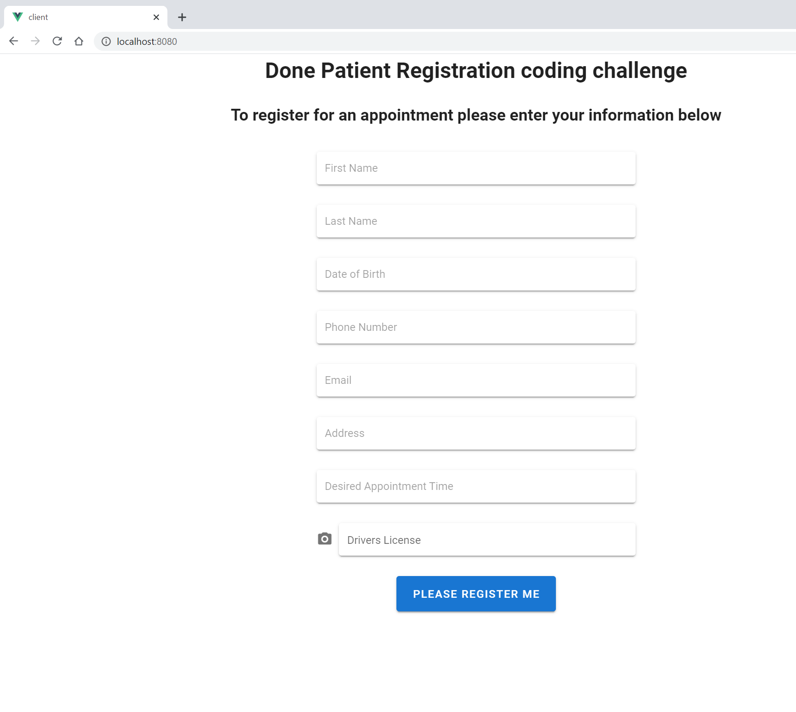
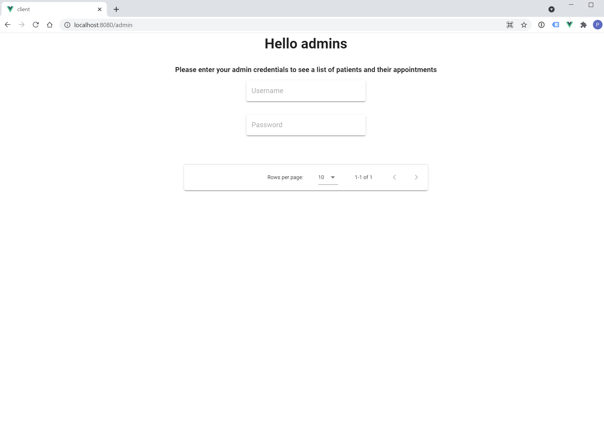

# donefirst
This is a code challenge for Done.  It is a Golang restful API backend consumed by a browser client written in Vue 2.0.

## Initial Setup
1. If not installed, install Golang, https://golang.org/doc/install
2. Install the Vue Cli, https://cli.vuejs.org/guide/installation.html.  Ensure that Node.js and npm or your favorite package manager is also installed.
3. Ensure Git is installed and download clone this directory to your go/src/ directory.
4. If running both the Golang Api and the client from your base host machine go to https://github.com/lewallep/donefirst/blob/master/client/src/main.ts#L11 and enter 'http://localhost:8081' for the axios.defaults.baseURL.
  1. If you plan on running the client seprately from your api this global variable will allow you to specify the base URL of your API requests to the vm running the api.

## Resetting the development database.
1. *cd* to the folder containing the file **sqliteinit.go** as seen in Github here: https://github.com/lewallep/donefirst/
2. Use **go run sqliteinit.go** and this will clear the DB file and add three registered patients *without* actual image files.  This has not been done yet.

## Running the API
1. Change to the directory where the main.go file is located and use **go run main.go** to run the API.  You should see a short message saying the api is running and the port being used.

## Running the Client
1. Open another terminal and *cd* to the **client** directory.  Use **npm run serve** to start the client.

## Running the Golang Api tests.
1. From the main folder, https://github.com/lewallep/donefirst, run **go test** 

## Navigating the application
- The homepage is the IP address specified above in *Initial Setup* step 4 and 4.1.  Browse there and you should see the patient registration page.
- To see the admin page where the admins can login and see a list of patients please navigate to **http://localhost:8080/admin** in the case of step 4.  Or to the ip or DNS address you specified in Initial Setup step 4.1

## Design choices and caveats
I did intend to finish and regret not being able to spend more time to finish the application thoroughly.  I decided to go beyond the strict interpretation of the take home specficiation in the following areas.
- Tests.  These helped me to repeat the queries easliy and I wanted to show I think about testing and what the edge cases of an application are from the very beginning.  These also helped me keep track of any changes to the database schema.
- The postman directory holds exported Postman, https://www.postman.com/downloads/ commands used for testing the API endpoints.
- Sqlite.  I wanted to have an entirely portable application from within Github.  If the purpose of this application happened to be a dive I would use a database more closely related to what the final iteration might be.
- Vue was used as this is the most current front end framework I have used and I simply did not have enough time to commit to using React.
- I chose to use Vuetify as I wanted to take the requirement of a *"beautiful"*  seriously so this required me to use a build in CSS package Vuetify, https://vuetifyjs.com/en/
- Axios was used for the restful commands https://github.com/axios/axios as I am familiar with it and it has never left me wanting yet.
- I thought the admin page did not need to be visited by every user or crawled by search engines so I chose to have it somewhat isolated which is why there is no link on the homepage to it.
- The grid of patient times was designed to be loaded automatically upon authentication of the username and password.  The front end of this has not been implemented yet.

## Images of the website.
#### Patient Registration

#### Admin Portal
